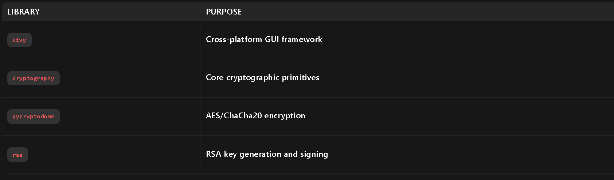
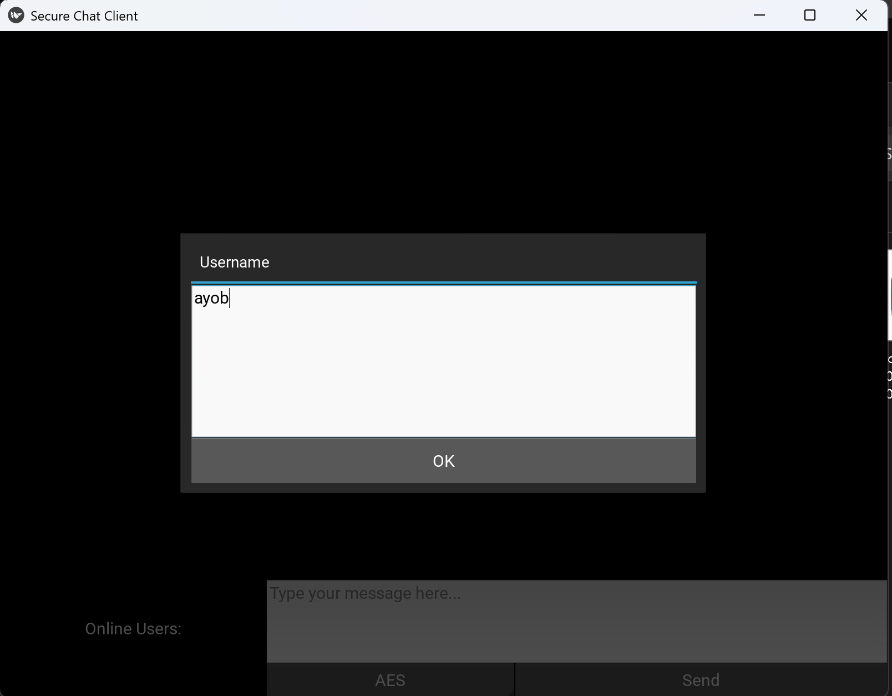
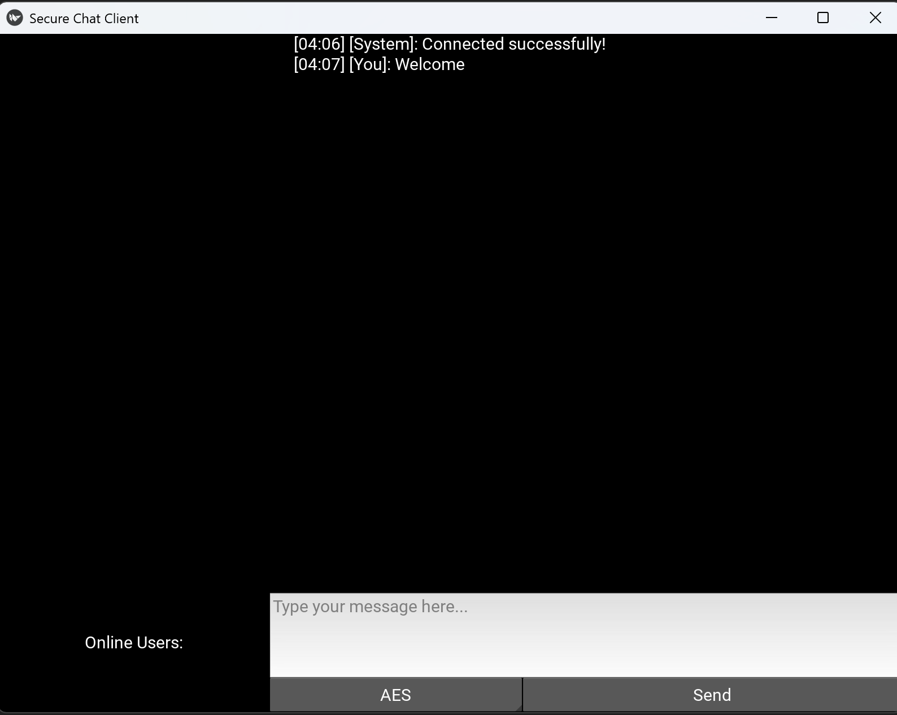

# Secure Chat Application

## End-to-End Encrypted Chat Using Hybrid Encryption (RSA + AES/ChaCha20)

### Project Overview
This project implements a secure chat application using hybrid encryption:

- **Asymmetric Encryption (RSA-2048):** For secure key exchange.
- **Symmetric Encryption (AES-256/ChaCha20):** For fast message encryption.
- **Digital Signatures (RSA-SHA256):** To ensure message integrity and authenticity.

The application includes:
- A Kivy-based GUI for user interaction.
- A TCP-based server to manage client connections and message relaying.

## Features

### 🔒 End-to-End Encryption
- Messages are encrypted client-side before transmission.
- Only the intended recipient can decrypt messages.

### 🔄 Hybrid Encryption
- RSA for secure exchange of symmetric keys.
- AES/ChaCha20 for message encryption.

### ✅ Digital Signatures
- Each message is signed to ensure it’s unaltered and from the correct sender.

### 📱 Cross-Platform GUI
- Built with Kivy for a user-friendly interface.

### 🛠️ Real-Time Updates
- Online users list and message history updates dynamically.

## Dependencies

Install required packages using:

```bash
pip install kivy cryptography pycryptodome rsa 
```

### Key Libraries



- **kivy:** Cross-platform GUI framework.
- **cryptography:** Core cryptographic primitives.
- **pycryptodome:** AES/ChaCha20 encryption.
- **rsa:** RSA key generation and signing.

## Usage

### 1. Run the Server

1. Open `server.py` and update `HOST` to your local/external IP.
2. Start the server:

   ```bash
   python server.py
   ```

### 2. Run the Client

1. Ensure the server is running.
2. Start the client:

   ```bash
   python client.py
   ```

3. Enter a **unique username** and choose an encryption method (AES/ChaCha20).

### 3. Test the Chat

- Send messages between clients.
- Observe encryption in action via the UI.

## Code Structure

### Client (`client.py`)

#### 🔑 Key Components:

- **RSA Key Generation:**
  ```python
  (my_public_key, my_private_key) = rsa.newkeys(2048)  
  ```

- **Message Encryption:**
  ```python
  def encrypt_text(message, key, algorithm):  
      if algorithm == "AES":  
          cipher = AES.new(key, AES.MODE_CBC)  
          ...  
      elif algorithm == "ChaCha20":  
          cipher = ChaCha20.new(key=key)  
          ...  
  ```

- **Digital Signing:**
  ```python
  def sign_message(plaintext):  
      hash_val = hashlib.sha256(plaintext).digest()  
      return rsa.sign(hash_val, my_private_key, 'SHA-256')  
  ```

### Server (`server.py`)

#### 🔑 Key Components:

- **Client Registration:**
  ```python
  def handle_client(client):  
      registration_data = client.recv(4096).decode()  
      data = json.loads(registration_data)  
      # Validate username and public key  
  ```

- **Message Broadcasting:**
  ```python
  def broadcast(message, exclude_client=None):  
      for client in list(clients.keys()):  
          if client != exclude_client:  
              client.sendall(message)  
  ```

## Requirements

- Python 3.13.1
- Required libraries (install using pip):
  
  ```bash
  pip install pycryptodome kivy
  ```

## Notes

- The server should be running before any client connects.
- Clients must use unique usernames to avoid conflicts.
- Encryption ensures secure communication, but users should still follow general security practices.

## YouTube Demo  
Watch the project in action:  
[](https://youtu.be/hlCiOwl9R5Y)  

## Screenshots

 



